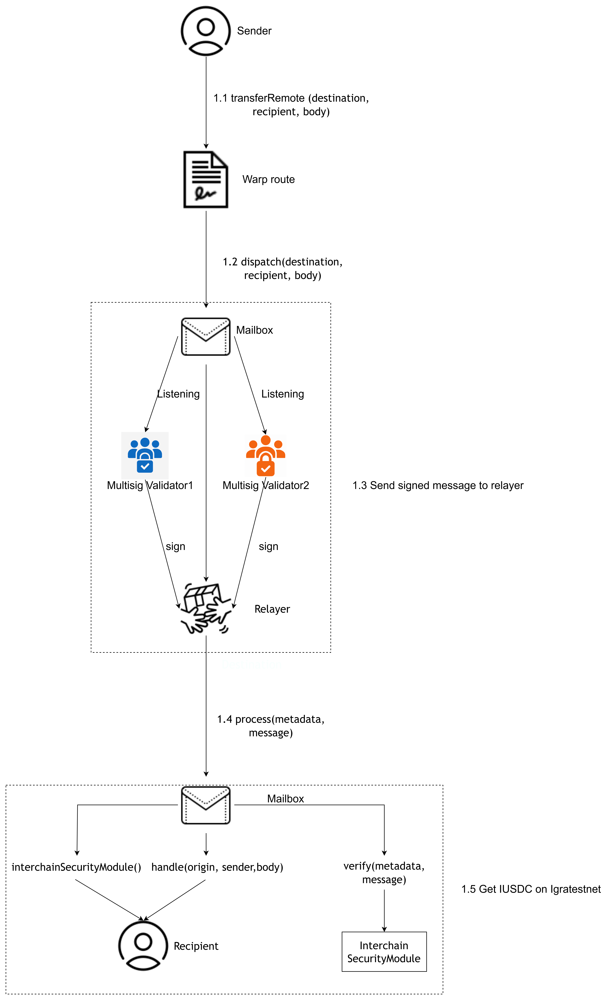

# Bridge Sepolia USDC to Igratestnet IUSDC

## 1. Cross-chain process overview 
*(example: 2-of-2 multisig ISM, bridging USDC from Sepolia to Igratest)*

## Five steps to bridge native USDC from Sepolia to Igratestnet

### 1.1 Call the Warp Route contract deployed by our team on Sepolia

### 1.2 The native USDC is locked in the Warp Route contract, after which the Warp Route contract sends a specially constructed message to the Mailbox indicating that the USDC has been locked

### 1.3  The running multisig validators listen to the messages in the Mailbox. After verifying the validity of the message, they sign it and publish the signatures to the relayer (in this example, we use a 2-of-2 multisig as the case).

### 1.4 The relayer deployed on Igratestnet, after collecting enough validator signatures for the message, calls the process function of the Mailbox contract on the Igratestnet .

### 1.5 The Mailbox contract calls the ISM contract deployed on Igratestnet to verify whether the message has been signed by a sufficient number of validators. If the verification passes, it then calls the Warp Route contract deployed on Igratest to mint the same amount of iUSDC to the recipient.
